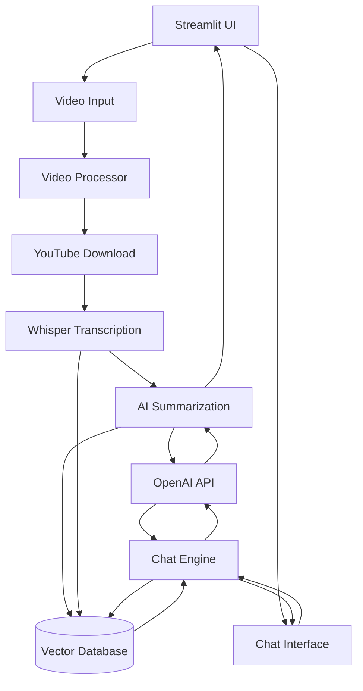

<div align="center">
  <h1>Video Mind AI 🎥🧠</h1>

  
  
  
  
  
  
  

  <h3>Videos to Insights, Instantly. ⚡</h3>

  <p align="center">
    <b>Video Processing | AI Summarization | Interactive Chat</b>
  </p>
</div>

## Overview
This project combines OpenAI's Whisper for accurate speech-to-text transcription with LangChain's powerful language processing capabilities to create meaningful summaries of YouTube video content. 

## Demo

https://github.com/user-attachments/assets/9cd8bd42-90fe-4293-8efa-abbc6469ef15

## Key Features

- 🎥 **Multi-video Support**: Process multiple YouTube videos simultaneously
- 📝 **Smart Summarization**: Get concise summaries of video content
- 💬 **Interactive Chat**: Ask questions about any of the processed videos
- 📜 **Full Transcripts**: Access complete transcripts of all videos
- ⚡ **Fast Processing**: Efficient parallel processing of videos
- 🔄 **Video Management**: Add or remove videos dynamically
- 📋 **Copy Functionality**: Easy copying of summaries and transcripts

## How It Works

1. **Video Processing**: The system downloads YouTube videos and transcribes them using OpenAI's Whisper
2. **Summarization**: AI generates concise summaries of the video content
3. **Interactive Chat**: Ask questions about any video - the AI combines information from all processed videos
4. **Management**: Add or remove videos anytime through the sidebar



## Project Structure
```
video-mind-AI/
├── src/                  # Source code
│   ├── transcriber.py   # Handles video transcription using Whisper
│   ├── summarizer.py    # Manages text summarization with LangChain
│   └── utils.py         # Utility functions
│   └── chat.py          # Handles chat with AI
├── app.py               # Main Streamlit application
├── .gitignore           # Git ignore file
├── requirements.txt     # Project dependencies
├── README.md           # Project documentation
└── LICENSE             # MIT License
```

## Technologies Used

- OpenAI's Whisper - For speech-to-text transcription
- LangChain - For AI chat and summarization
- Streamlit - For the web interface
- FFmpeg - For audio processing

## Requirements

- Python 3.7+
- OpenAI API key
- FFmpeg
- Required Python packages (see requirements.txt)

## Installation

1. Clone the repository:
```bash
git clone https://github.com/riyanshibohra/video-mind-AI.git
cd video-mind-AI
```

2. Create and activate a virtual environment:
```bash
python -m venv venv
source venv/bin/activate  # On Windows: venv\Scripts\activate
```

3. Install the required dependencies:
```bash
pip install -r requirements.txt
```

4. Set up environment variables:
Create a `.env` file in the project root with the following:
```
OPENAI_API_KEY=your_api_key_here
```

## Usage

1. Start the Streamlit application:
```bash
streamlit run app.py
```

2. Open your web browser and navigate to the provided local URL (typically http://localhost:8501)

3. Enter YouTube video URLs:
   - Add a single video URL in the sidebar
   - Or paste multiple URLs in the main interface
   - Click "Process Videos" to start analysis

4. Explore the features:
   - View summaries in the "Summaries" tab
   - Chat with AI about the videos in the "Chat" tab
   - Access full transcripts in the "Transcripts" tab
   - Manage videos through the sidebar

## License

This project is licensed under the MIT License.
